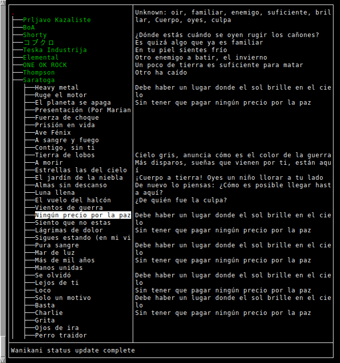

# Givematerial (Go version)

This is my go-rewrite of Givematerial.

Givematerial is a program which annotates texts using your vocabulary
knowledge from other sources (Anki and Wanikani). For each text it displays
which words you still have to learn to be able to read that text.




## Configuration

Givematerial requires a configuration file at
`.config/givematerial/givematerial.json`. Here is an example:

```json
{
    "anki_file": "/home/user/.local/share/Anki2/User 1/collection.anki2",
    "anki_decks": {
        "es": ["Spanisch", "Netflix Spanisch"],
        "ja": ["Japanisch"]
    },
    "wanikani_api_token": "YOUR-WANIKANI-TOKEN"
}
```

## Text Storage

The go version is currently lacking a way to import new texts. Texts
must have been imported with the C++ version.
